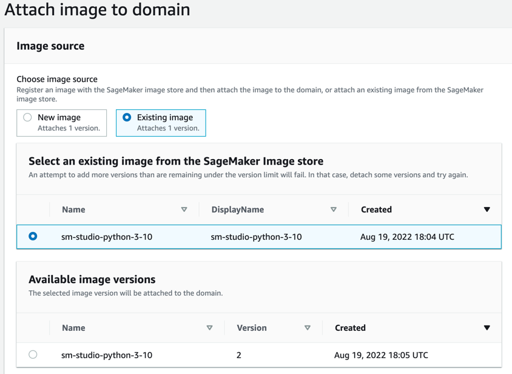

# Base Image (python 3.10)

## Getting started

This repo contains a base image to be used in SageMaker Studio.

### Steps

1 - Merge your code to main to build a new image and push it
to [ECR](https://us-east-1.console.aws.amazon.com/ecr/repositories?region=us-east-1) repository.

2 - Go to SageMaker dashboard
-> [Images](https://us-east-1.console.aws.amazon.com/sagemaker/home?region=us-east-1#/images) -> Create Image.

3 - After your image is pushed to ECR, you'll be able to find
it [here](https://us-east-1.console.aws.amazon.com/ecr/repositories?region=us-east-1). Copy the full path and paste it
as image source

4 - Complete image properties section **(use: AmazonSageMaker-ExecutionRole)**

_Note: It's strongly recommended to add a tag like owner : user@email.mx_

5 - In Image Type select **SageMaker Studio image** and Kernel name **python3** as follows:

6 - Go
to [Control Panel](https://us-east-1.console.aws.amazon.com/sagemaker/home?region=us-east-1#/studio/d-6n0oluhjkszf) ->
Images -> Attach Image

7 - Select **Existing image**, choose one

8 - Repeat the process in steps 4 & 5

9 - Now you can use the new image at SageMaker Studio.

_Note: You need to shut down your studio to see the new option available._
